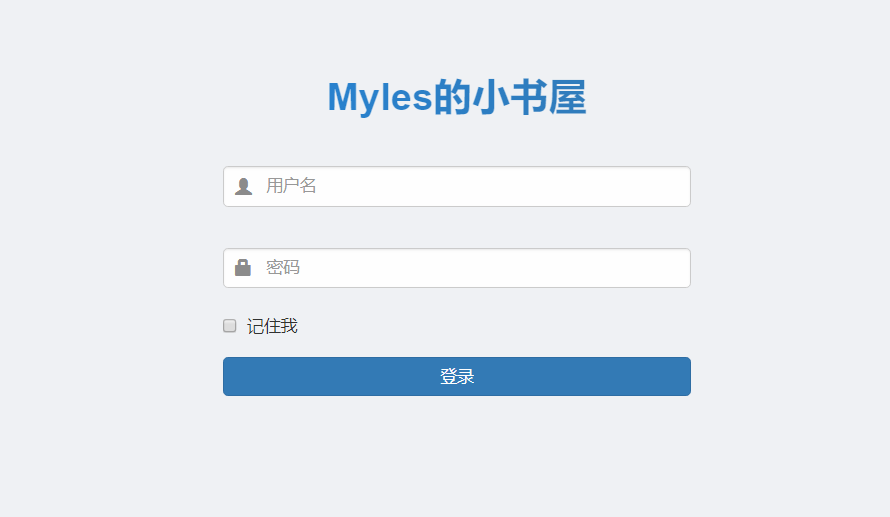
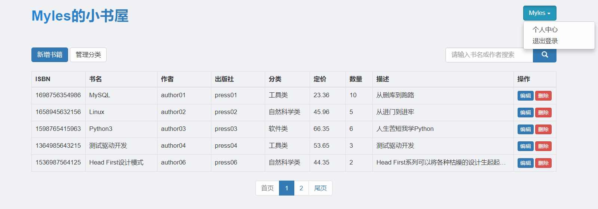
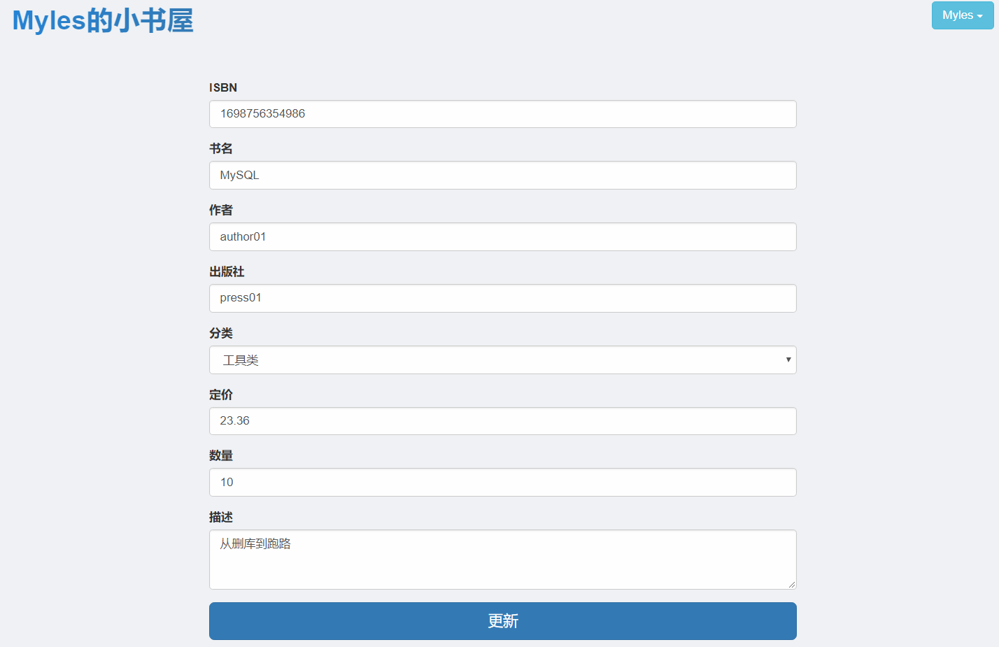
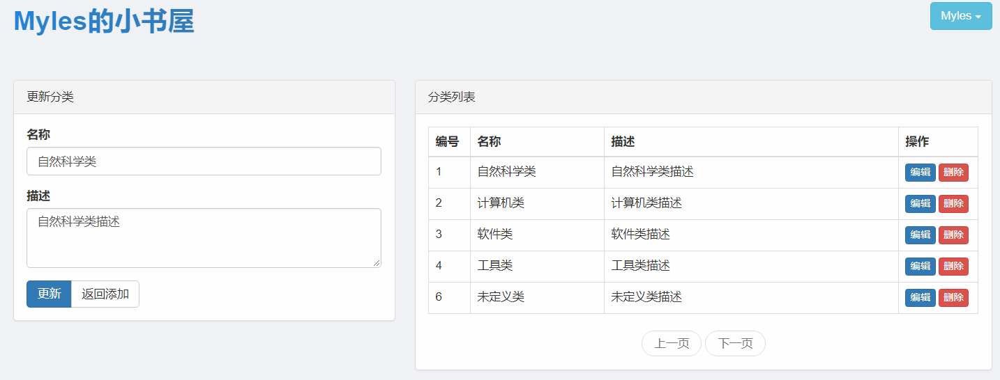
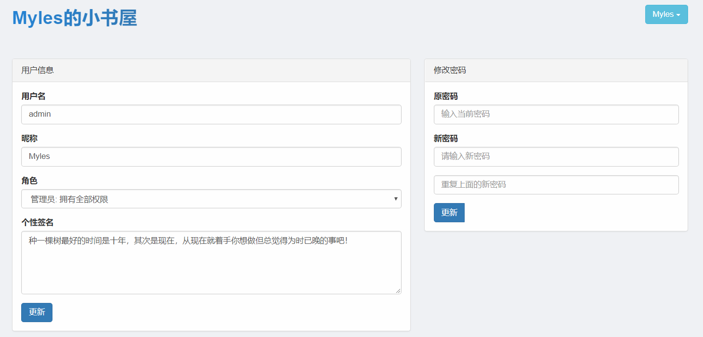

# SSM整合项目: 个人图书管理系统

一个简单的SSM整合练手项目。

主要功能：登录、图书管理、图书分类、用户管理(只做了更新自己信息的功能)

你可以使用该“账号：admin，密码：123456 ”登录系统

你可以通过修改”…/support/MyConstant.java”下“SYSTEM_NAME”来更改系统的名称

## 使用技术

Spring 5.x、SpringMVC + MyBatis 3.x

使用 mysql 8.x、lombok

使用 thymeleaf 模板引擎

HTML5、CSS、Javascript、Bootstrap 3.x、less

等

## 表设计

数据库表名: book_management

**图书表 (book)**

| 字段         | 类型          | 描述         |
| ------------ | ------------- | ------------ |
| id           | int(11)       | 书籍编号     |
| isbn         | char(13)      | 国际标准书号 |
| name         | varchar(127)  | 书籍名称     |
| author       | varchar(63)   | 书籍作者     |
| press        | varchar(63)   | 书籍出版社   |
| price        | double        | 书籍定价     |
| count        | int(11)       | 书籍数量     |
| introduction | varchar(1023) | 书籍简介     |
| category_id  | int(11)       | 书籍分类编号 |
| update_time  | timestamp     | 更新时间     |
| create_time  | timestamp     | 创建时间     |

**图书分类表 (category)**

| 字段        | 类型         | 描述     |
| ----------- | ------------ | -------- |
| id          | int(11)      | 分类编号 |
| name        | varchar(63)  | 分类名称 |
| description | varchar(255) | 分类描述 |
| update_time | timestamp    | 更新时间 |
| create_time | timestamp    | 创建时间 |

**用户表 (user)**

| 字段        | 类型         | 描述     |
| ----------- | ------------ | -------- |
| id          | int(11)      | 用户编号 |
| username    | varchar(127) | 用户名   |
| password    | varchar(255) | 用户密码 |
| nickname    | varchar(63)  | 用户昵称 |
| description | varchar(511) | 个性签名 |
| role        | varchar(63)  | 角色     |
| update_time | timestamp    | 更新时间 |
| create_time | timestamp    | 创建时间 |

## 效果图

**登录**

​	

**书籍管理**

**添加/修改书籍**

**书籍分类管理**

**个人中心**

